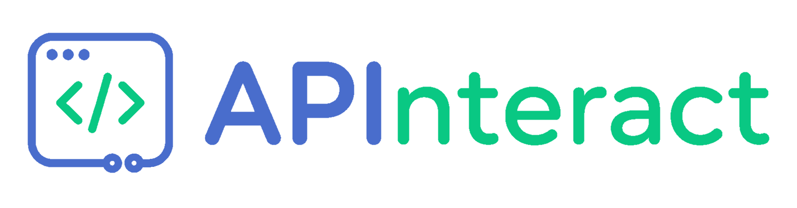

<p align="center">
  
</p>

# APInteract

APInteract is a free and open-source API client for developers. It is intended
to provide a professional, self-hostable workspace for designing, organizing,
executing, and reviewing API requests without placing core capabilities behind
proprietary services.

## Project Status

APInteract is an actively developed product preparing for its
`0.1.0-alpha1` public release. Its core self-hosted workflow is operational
across the Vue frontend, backend, request proxy, authentication, persistence,
scripting, and outbound request-execution boundaries.

The project is usable from source today. During active alpha development,
interfaces, deployment guidance, and upgrade expectations may continue to
evolve and will be documented with each release.

## Current Capabilities

APInteract currently:

- supports REST API request design, execution, and response inspection;
- organizes versioned requests into nested collections and workspaces;
- provides workspace environments, variables, secret values, and variable
  aliases;
- resolves inherited collection headers and scoped variables explicitly;
- runs sandboxed pre-request and post-response scripts through a documented
  SDK;
- supports username-and-password authentication and isolated user sessions;
- imports OpenAPI and HAR request definitions through built-in plugins;
- presents raw, structured, HTML, image, and binary response content through
  bounded viewers; and
- runs as a verified all-in-one container for straightforward self-hosting.

## Run APInteract

Docker Engine with the Compose plugin is required. From the repository root:

```sh
deploy/scripts/aio up
deploy/scripts/aio init-admin
```

Open `http://localhost:8080/web-ui/` and sign in with the administrator account
you created. See the [all-in-one deployment guide](deploy/aio/README.md) for
configuration, storage, networking, backup, and verification guidance.

## Architecture

APInteract consists of three independently defined components:

- a Vue 3 and TypeScript frontend built with Vite;
- a Node.js backend for business logic, persistence, orchestration, and
  scripting; and
- a proxy service that performs outbound API requests.

The frontend and backend communicate through WebSocket. The backend reaches
the proxy through its authenticated REST API whether both components share the
all-in-one container or are deployed across a network boundary. SQLite is the
current persistent store; database-specific behavior remains behind a portable
persistence boundary.

The public [architecture overview](docs/architecture/README.md) describes
component ownership, request execution, communication planes, and deployment
topologies.

The source-built [all-in-one deployment](deploy/aio/README.md) packages the
compiled frontend, backend, and loopback proxy in one container for local
self-hosting and full-boundary verification.

The `0.1.0-alpha1` release is expected to support the all-in-one topology only.
A standalone proxy image is planned shortly afterward for deployments that
need outbound requests to originate from another network. In that topology,
the frontend and backend still run from the all-in-one image, while the backend
is configured with the remote proxy's address and bearer credential instead of
using its container-local proxy.

## Documentation

Public project documentation is maintained in [docs](docs/README.md).

The [component API index](docs/api/README.md) lists the public contracts used
between APInteract components. The proxy component's canonical
[OpenAPI JSON document](docs/proxy-api/openapi.json) currently defines the
`0.1.1` backend-to-proxy execution protocol.

The proposed
[authentication provider plugin contract](docs/plugins/authentication-providers.md)
describes how additional login methods can integrate without replacing
APInteract users, authorization, or session management.

## License

APInteract is licensed under the [MIT License](LICENSE).
